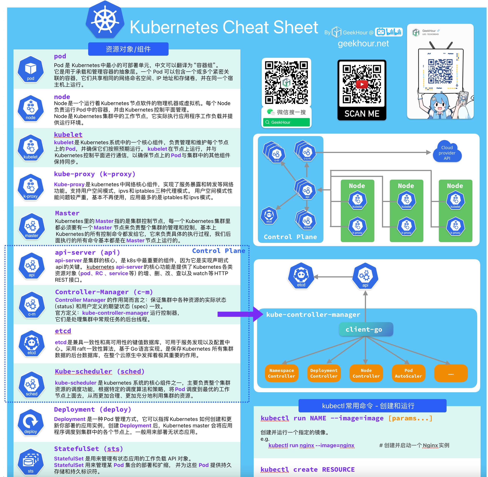

# 【GeekHour】一小时Kubernetes课程

_Read this in other languages:_
[_English_](README.en-US.md)

本项目是[GeekHour](https://geekhour.net)的一小时Kubernetes课程的配套代码和资料仓库，主要包括以下内容：

- 课程中的命令手册
- 课程视频中使用到的所有配置文件和源码
- 课程中的文档和笔记

## 课程视频
[Youtube]()
[bilibili]()

## 课程简介

组件太多，学习曲线太陡，学习成本太高，这是很多人对Kubernetes的第一印象。

但是，Kubernetes的确是一个非常优秀的容器编排系统，它的出现解决了容器编排的很多问题，让容器编排变得更加简单、高效、可靠。

本课程将带你快速入门Kubernetes，让你在一小时内快速掌握Kubernetes的基本概念和使用方法。

课程中的CheatSheet在本仓库的[doc](doc)目录下，欢迎大家下载使用。

## 相关工具和资源

* [Kubernetes](https://kubernetes.io/)  也称为 K8s，是用于自动部署、扩缩和管理容器化应用程序的开源系统。

* [minikube](https://minikube.sigs.k8s.io/) 是一个用于在本地运行单节点Kubernetes集群的工具。

* [Multipass](https://multipass.run/) 是一个轻量级虚拟机管理器，可在Linux、Windows和macOS上快速创建和启动虚拟机。

* [k3s](https://k3s.io/) 是一个轻量级的Kubernetes发行版，专为生产工作负载和边缘设备而设计。

